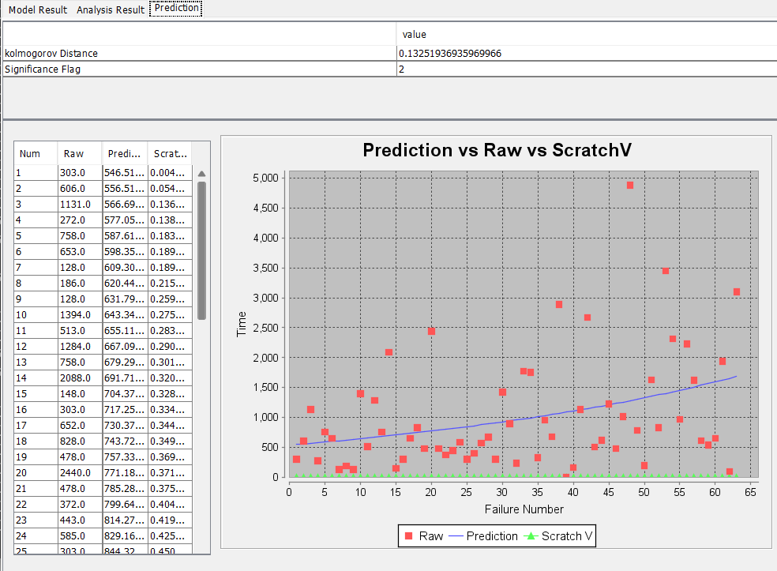
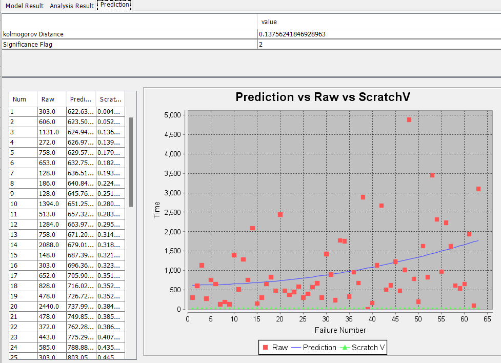
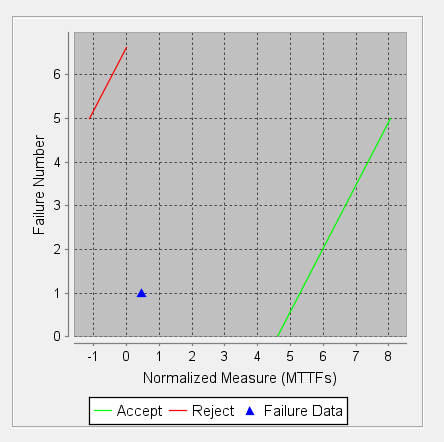
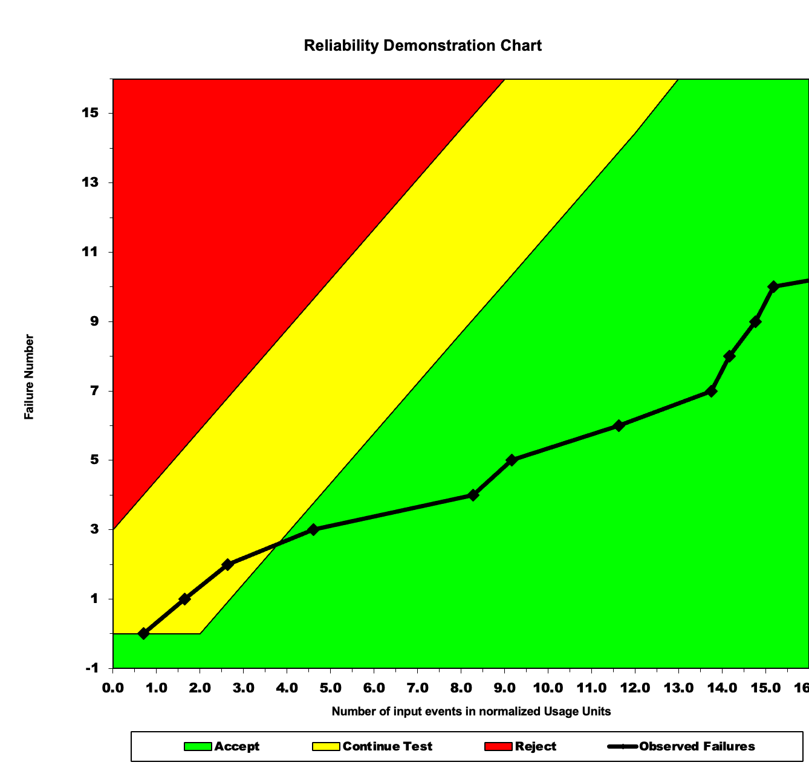
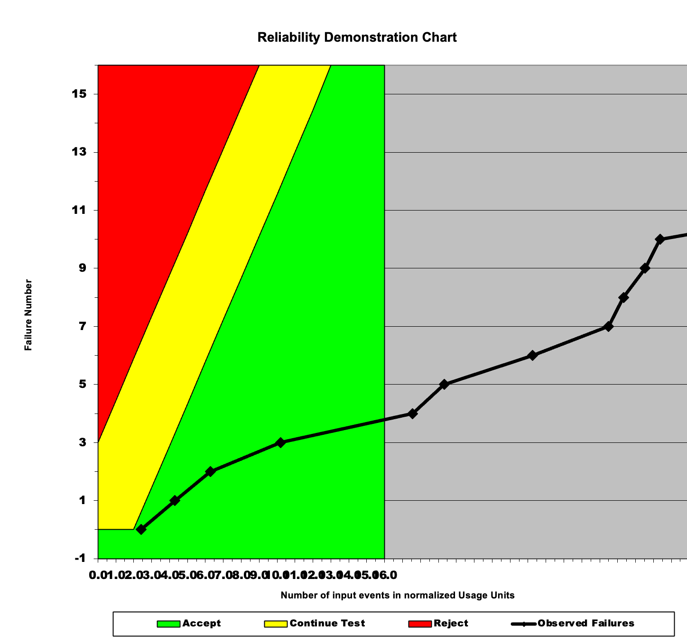

**SENG 438- Software Testing, Reliability, and Quality**

**Lab. Report \#5 – Software Reliability Assessment**

| Group \#: 21      |   |
|-------------------|---|
| Student Names:    |   |
| Brian Nguyen      |   |
| Dimitar Janevski  |   |
| Ideen Banijamali  |   |
| Javier Capobianco |   |

# Introduction
This lab report demonstrates the analysis of a reliability growth testing chart and a reliability demonstration chart. The analysis involves comparing two models, Geometric and Little Varral's Bayesian models, to determine which model fits the data points the best. We also discussed the advantages and disadvantages of the decision making progress given a target failure rate. The report also discusses how the value of MTTFmin was decided based on the maximum number of acceptable failures in correlation to the total number of input events. It also discusses the advantages and disadvantages of using a reliability demonstration chart.
Overall, this report provides a comprehensive analysis of the reliability of a system using two different methods and discusses the advantages and disadvantages of each method.

# Assessment Using Reliability Growth Testing 
<u>Result of model comparison (selecting top two models)</u>

We tried the geometric and Littlewood and Varral’s Bayesian models. Both of these models presented very similar growth curves. However, we found that the Littlewood and Varral’s Bayesian model was slightly more fitted to the data points. This is because the curve for the geometric was too linear and did not track the lower MTTF points as closely as the Littlewood model did. In other words, it was influenced by the high MTTFs occurring at higher runtimes and grew too fast. The littlewood model had a bigger curve in its lower region allowing it to track both the low MTTFs and high MTTFs accurately. FOr this reason, it was a better fit to the MTTFs presented in this reliability growth chart.

<u>Result of range analysis (an explanation of which part of data is good for proceeding with the analysis) </u>

Our TA stated that the Data we used has already been filtered and no additional Laplace filtering is necessary.

<u>Plots for failure rate and reliability of the SUT for the test data provided</u>

Geometric Model

Littlewood and Varral’s Bayesian Reliability

Reliability Demo Chart

<u>A discussion on decision making given a target failure rate</u>

A failure rate is the frequency at which a system or process fails to meet its intended objective, and a target failure rate is the desired level of failure that a system or process is expected to achieve. The target failure rate should be set based on the specific requirements of the product, such that a much lower target failure rate can be appropriate in certain situations. This metric is very useful to help guide the decision making progress of the product, thus if the product does not meet the target failure rate we can reject the product. For example if a copier has a target failure rate of 1 failure per 10,000 pages and an error or failure happens every 7,000 pages we can reject the copier since it does not meet the target failure rate. And in some cases such as flights or airplanes a much lower target failure is preferred since the consequences when it fails are much higher than that of a copier. Overall the target failure rate is a powerful metric since it helps provide quality standards and helps to manage the risks involved.

<u>A discussion on the advantages and disadvantages of reliability growth analysis</u>

Reliability growth models should only be used on data where the overall reliability is increasing as testing continues, and reliability is increasing if the MTBF increases as the total number of failures increases during testing. An advantage of RGA (reliability growth analysis) is that you can see if the product reliability is increasing or decreasing and thus can make informed decisions about the project. If you start this analysis as soon as you start the project, we can have an early detection of reliability issues which can help the project in the long run. 
Some disadvantages of the RGA is that it is limited by data quality, this analysis is only as accurate as the data is based on so if the data is inaccurate the graph will also be inaccurate. One other thing is that the analysis takes a lot of computation time and is very resource heavy, since it requires significant data collection, some complicated formulas and it is an overall intensive process. 

# Assessment Using Reliability Demonstration Chart 

<u>3 plots for MTTFmin, twice and half of it for your test data </u>

MTTFmin Chart:

Double MTTFmin Chart:

Half MMTF Chart:

<u>Explain your evaluation and justification of how you decide the MTTFmin</u>

We decided our value for MTTF min based on the maximum number of acceptable failures in correlation to the total number of input events. Using RDC-11, we analyzed this data to identify the optimal balance between minimizing failures and allowing for variability in the inputs. Based on our analysis of Failure Report 2, we chose an MTTFmin of 308, which translates to 325 acceptable failures per 100,000 input events.

While deciding our MMTF, we aimed to minimize the number of failures while still allowing for a reasonable level of variability in the inputs. By analyzing the data and applying our knowledge, we determined that an MTTFmin of 308 was the best choice.

<u>A discussion on the advantages and disadvantages of RDC</u>

RDC can be a powerful tool to assess the reliability of a system when there is a limited amount of failure data. This makes RDC very flexible. Additionally, due to its simplicity and the lack of data required, RDC is a very time and cost-efficient tool for evaluating the reliability of a system. Since RDC relies on adjustable risk parameters, this also adds a layer of versatility as you are able to play around with different settings based on discrimination ratio, customer risk, and developer risk, to define boundaries that are suited for your system.

However, there are also notable disadvantages when it comes to RDC. For example, it depends on knowing the failure number and its time. In scenarios when either of these pieces of information is unknown, such as not knowing the time of each failure, RDC is no longer a viable option to assess the reliability of the system. Additionally, as RDC only generates a graph depicting the reliability trend and whether it is acceptable or now, it cannot provide a discrete quantitative description of the reliability of the system. This may be a disadvantage when specific reliability metrics need to be met.

# Comparison of Results
By comparing the two different parts, we can better understand the reliability of the system as well as understand potential differences between the two tools. First, we can compare the generated models with our RDC. As we can see from the RDC, as time increases the reliability increases as we need more and more time to reach the 60th+ failure. Looking at the RDC, which maps the failure number vs the normalized failure data, we can see that the generated line enters the green line as we progress along the X-axis. We can also compare the reliability demonstration chart generated in Part 1 with the reliability demonstration chart generated in Part 2. In Part 1, the failure data lies in between the acceptable and rejected ranges, while our graph from Part 2 lays more in the acceptable range.

Overall, the processes in Part 1 gave us a more quantitative perspective on the reliability of the system, while Part 2 gave us a more qualitative perspective.

# Discussion on Similarity and Differences of the Two Techniques
Both the reliability demonstration chart and reliability growth analysis are based on the time between failures and the target failure rate (MTTF), however, reliability growth analysis can also take into count failure count. They are both tools used to assess the reliability of a system with differences in the output they produce. RDC can give us a graph that tells us whether our system meets an acceptable standard for reliability, requires more testing, or is unacceptable, while reliability growth analysis can help us model the number of failures over time. A key difference is that RDC just tells us whether the system’s reliability is acceptable or not, while reliability growth testing gives us a more quantitive answer to this question.

# How the team work/effort was divided and managed
For the report we were able to split up the work in groups of two and each group took a half of the report, group 1 worked on the time between failure report and another group worked on the reliability demonstration chart, and at the end we all held each other accountable and talked about what each of us did, so the other group could learn. 

# Difficulties encountered, challenges overcome, and lessons learned
We were able to learn a lot from this lab about how to use different tools to assess the reliability of software, and how to interpret their results. When performing reliability growth analysis, we learned how to compare models and pick the correct one. We also learned about the importance of selecting the right range for your data when performing reliability growth analysis. When using the RDC, we learned about the impact each of the parameters has on the graph’s boundaries, and how modifying the MTTF affects our output. We also learned that there is a lot of value in working through problems together as a group, especially new problems, as the discussion around obstacles faced and how to overcome them is really valuable in making progress and understanding the material.

# Comments/feedback on the lab itself
